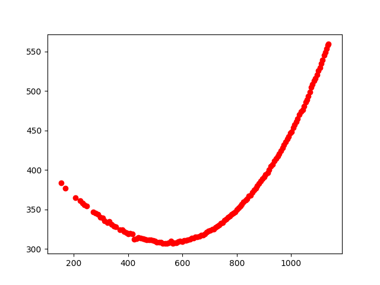
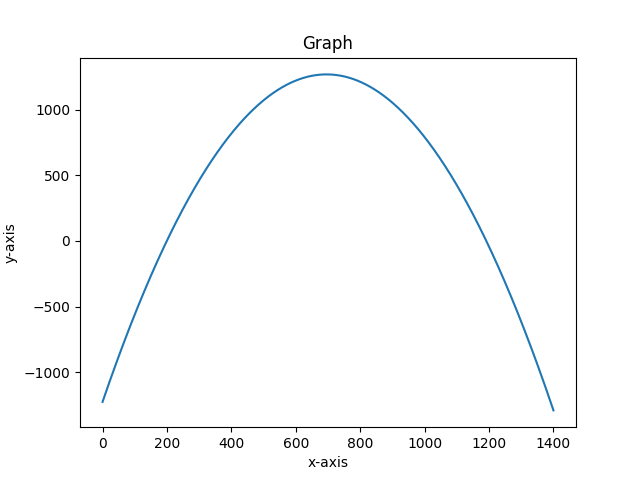
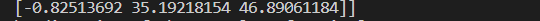
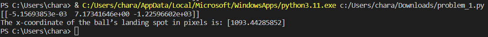
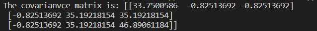
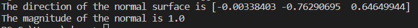
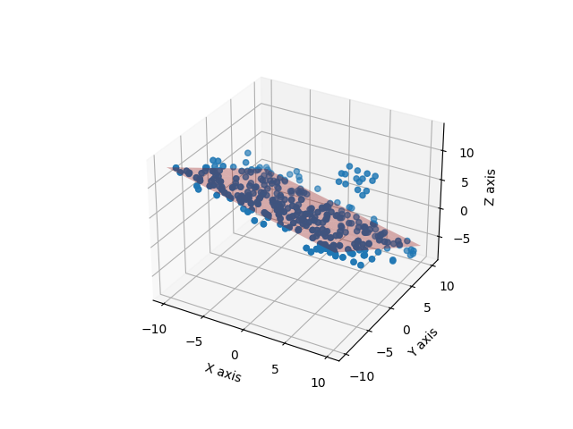
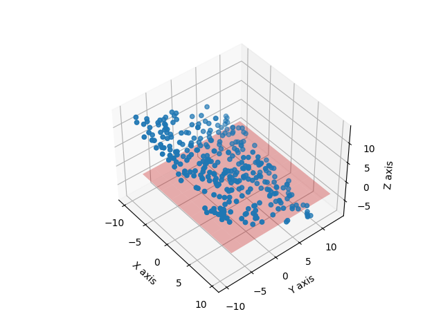

# ENPM673 - Perception for Autonomous Robots
## Contents:

- 1.1.pdf
- 1.1.png
- 1.2.b.png
- 1.2.png
- 1.3.png
- 1.3_output.png
- 2.1.1.png
- 2.1.2.png
- 2.1.a_output.png
- 2.1.b.png
- 2.2.1.1.png
- 2.2.1.2.png
- ball.mov
- covariance.1.py
- LAST.png
- pc1.csv
- pc2.csv
- plot_for_1.1.png
- plot_for_1.2.png
- problem 2.py
- problem_1.py
- Ransac.png
- README.md
- Report.pdf
- standard_least_square.png
- total_least_square.png

## Dependencies
python 3.11 (any version above 3 should work) Python running IDE (I used VS Code)

## Libraries
- import cv2 as cv,os
- import numpy as np
- import matplotlib.pyplot as plt,math
- from mpl_toolkits.mplot3d import Axes3D
- import csv as csv
- import random

## Steps to run the program
1. Install all libraries necessary
2. Run .py files

## Problem 1: Parabolic Motion of a Red Ball

In this problem, a video of a red ball thrown against a wall is analyzed under the assumption that the ball’s trajectory follows a parabolic path.

### 1. Detect and Plot the Pixel Coordinates
Detect and plot the pixel coordinates of the center of the ball in each frame of the video using OpenCV. The red channel is filtered to identify the ball.

- **Result**:  
  

### 2. Fit a Parabolic Curve Using Standard Least Squares
Use Standard Least Squares to fit a curve to the coordinates extracted in the previous step.

- **2a** Print the equation of the estimated parabolic curve.
- **2b** Plot the extracted data points alongside the fitted curve.

- **Results**:
  - **Equation and Plot**:  
    

  - **Fitted Curve with Data**:  
    

### 3. Compute the X-Coordinate of the Landing Spot
Assuming the origin is at the top-left of the video frame, compute the x-coordinate of the ball’s landing spot, where the y-coordinate is defined as 300 pixels greater than the first detected y-coordinate.

- **Result**:  
  

## Problem 2: Surface Fitting Using LIDAR Point Cloud Data

This problem involves analyzing LIDAR point cloud data, specifically (x, y, z) coordinates on the ground plane, using data files `pc1.csv` and `pc2.csv`. Different estimation techniques are implemented to model a surface through the point cloud data.

### 1. Compute the Covariance Matrix and Surface Normal
Using data from `pc1.csv`:

- **1a** Compute the covariance matrix.
- **1b** Use the covariance matrix to compute the magnitude and direction of the surface normal, assuming the ground plane is flat.

- **Results**:
  - **Covariance Matrix**:  
    

  - **Surface Normal Direction**:  
    

### 2. Surface Fitting Using Different Estimation Methods
Using data from `pc1.csv` and `pc2.csv`:

- **2a** Fit a surface using Standard Least Squares and Total Least Squares. Plot and interpret the fitted surfaces.
- **2b** Fit a surface using RANSAC (implemented from scratch). Briefly explain the steps of the RANSAC process, the parameters used, and plot the fitted surface alongside the data. Discuss which method is preferable for outlier rejection.

- **Results**:
  - **Standard Least Squares Fit**:  
    

  - **Total Least Squares Fit**:  
    

  - **RANSAC Surface Fit**:  
    